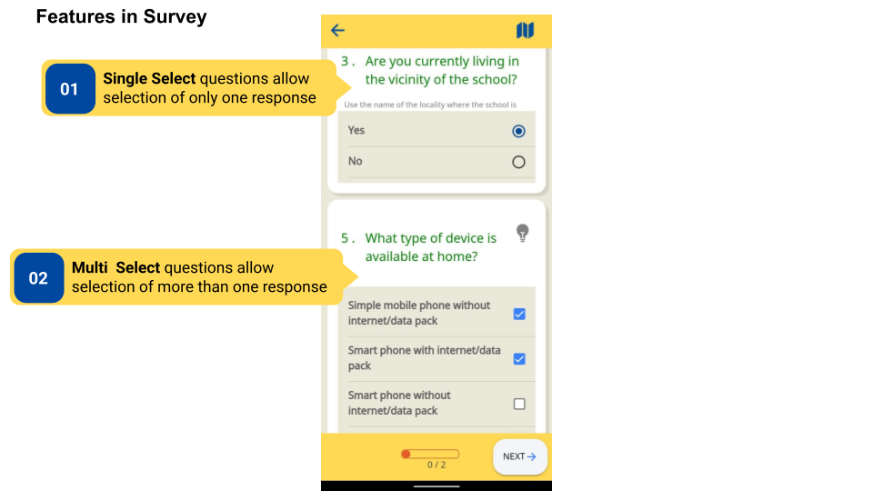
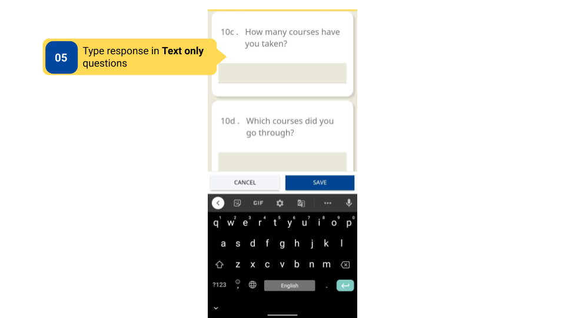
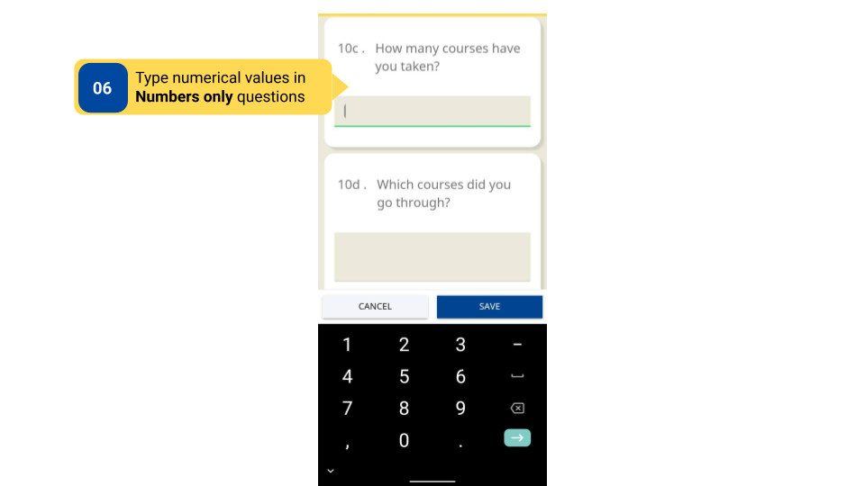
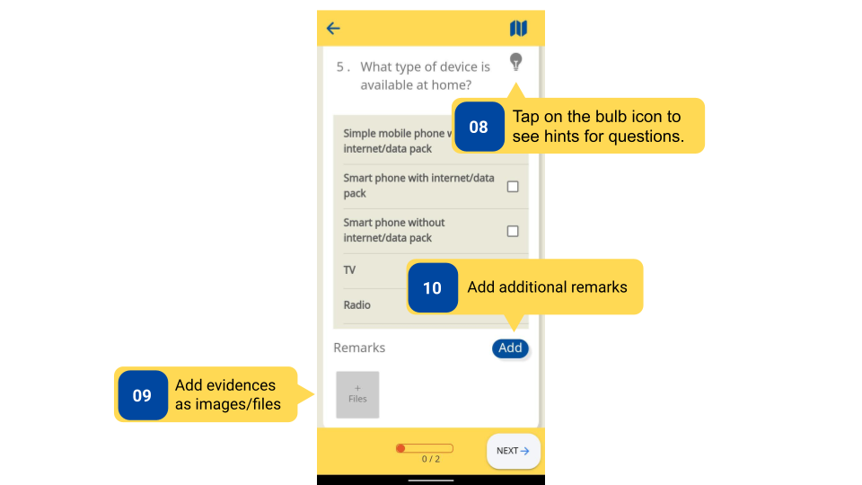
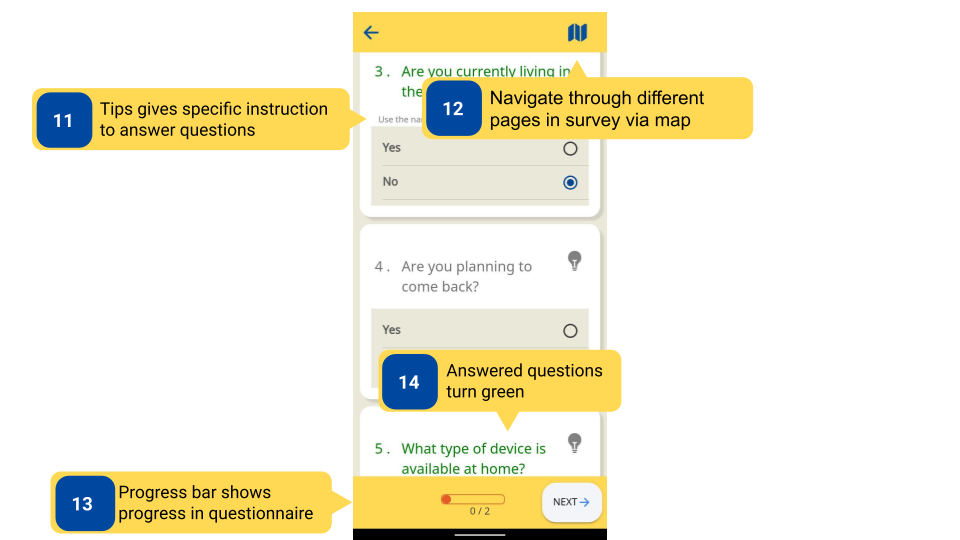
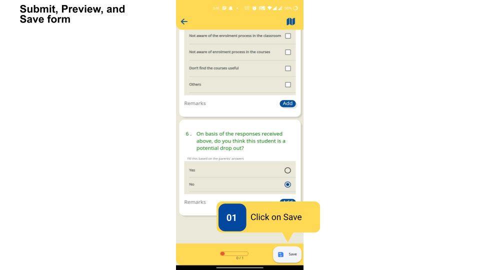
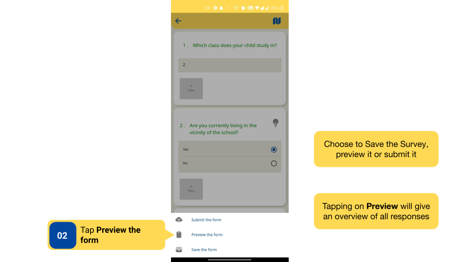
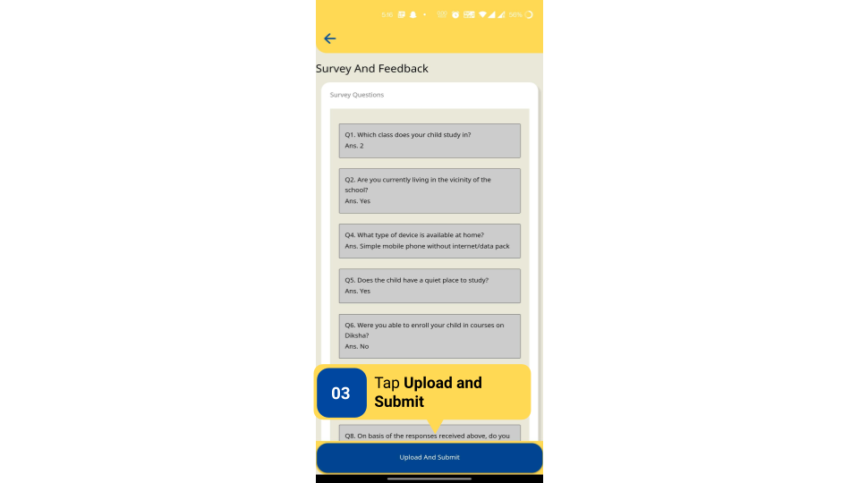

### Overview

- A Survey has different kinds of questions and features that can be used to navigate through the questionnaire. These include Single-Select, Multi-Select, Date entry, Slider type, Text only, and Number only questions. 

- Surveys can be saved before submitting to save the progress of responses filled. Users can come back to saved responses at any point before submitting the Survey.

- After all the questions have been answered in a Survey, the **Submit** button is enabled, and users can submit the Survey.

- Users can download a Survey to be filled offline. The Survey can be saved offline and submitted when an internet connection is available. Downloaded Surveys can be accessed using the **Download** tab on the bottom navigation panel of the DIKSHA app.

### Before You Begin

<table>
  <tr><td>Who can access Surveys?</td>
  <td>HTs and Officials</td>
  </tr>
  <tr><td>What is needed?</td>
  <td><ul><li>A Survey is started, and the user is on the questionnaire page.</li>
  <li>An active internet connection to save the Survey form online.</li></ul></td>
  </tr>
</table>

### Outcome

<table>
 <tr><td>What will be the outcome?</td>
 <td><ul><li>Identify types of questions and features that can be used for navigation.</li>
 <li>Survey progress is saved before submission.</li>
 <li>Survey is submitted.</li>
 <li>The Survey questionnaire is saved offline.</li></ul></td>
 </tr>
</table>

### Features of a Survey

Feature of a Survey

<table>
<tr>
  <th>Image with instructions</th>
</tr>
  <tr>
    <td></td>
  </tr>
  <tr>
    <td></td>
  </tr>
  <tr>
    <td></td>
  </tr>
  <tr>
    <td></td>
  </tr>
  <tr>
    <td></td>
  </tr>
  <tr>
    <td></td>
  </tr>
  <tr>
    <td></td>
  </tr>
  <tr>
    <td></td>
  </tr>
  <tr>
    <td></td>
  </tr>
</table>

### What's Next?

[Survey Reports on DIKSHA App](../survey-reports/index.html){:target="_blank"}