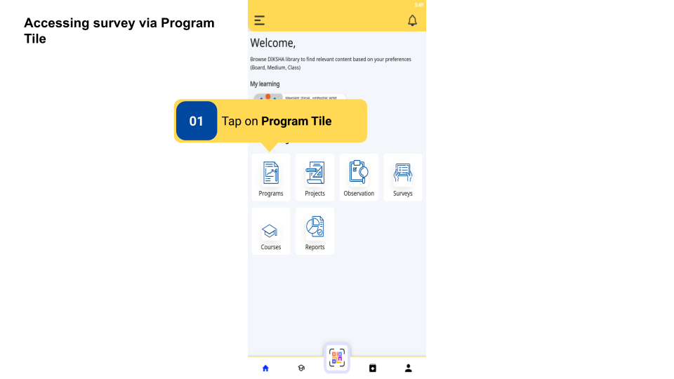
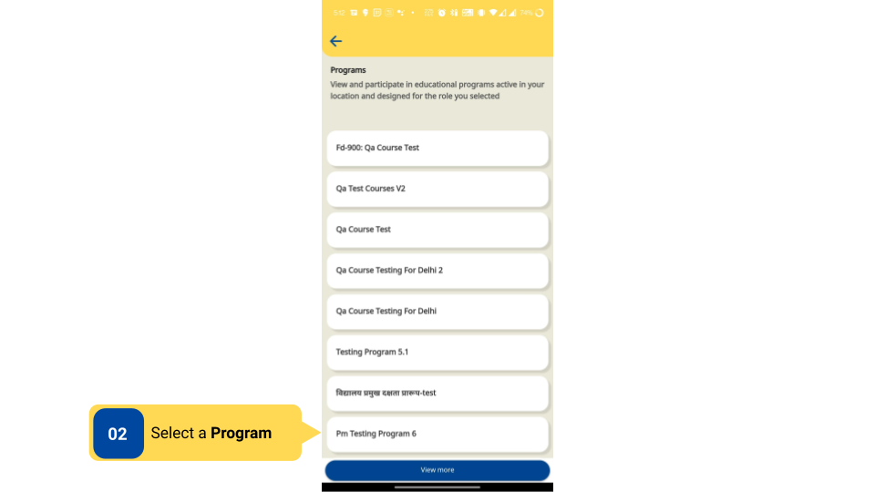
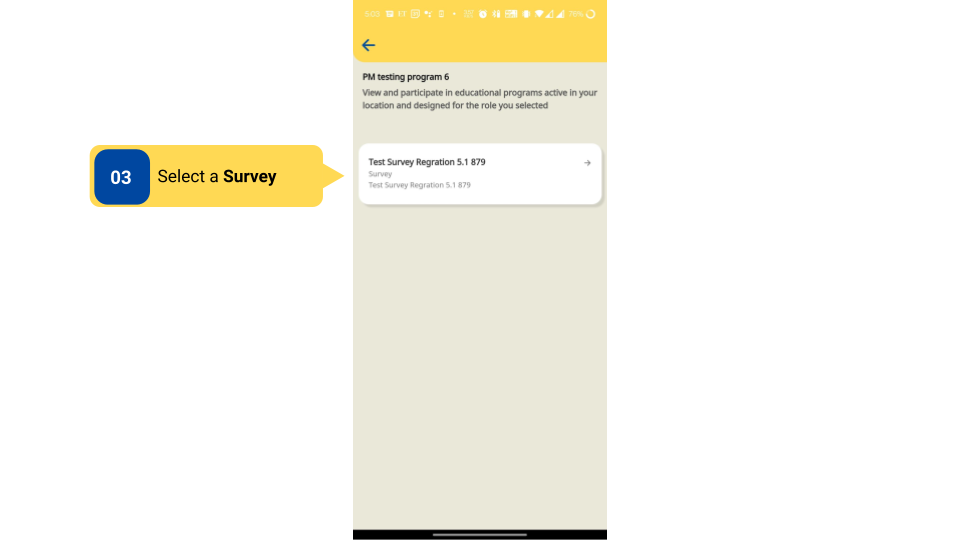
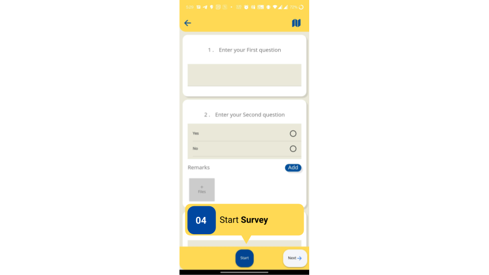
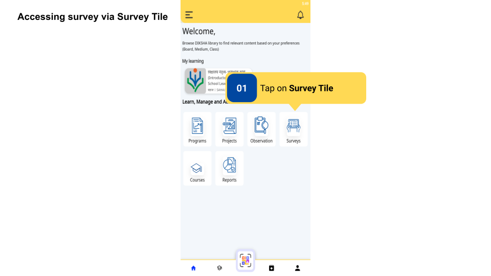
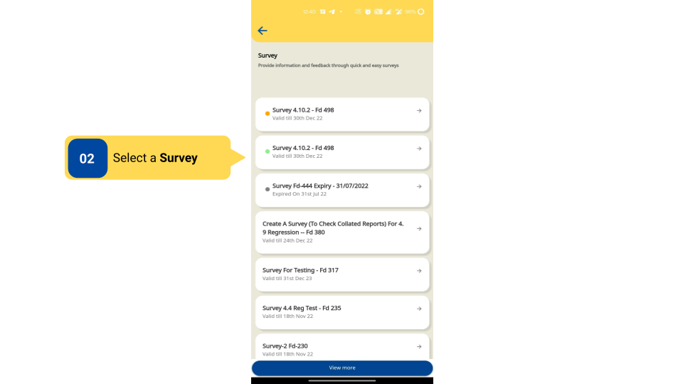
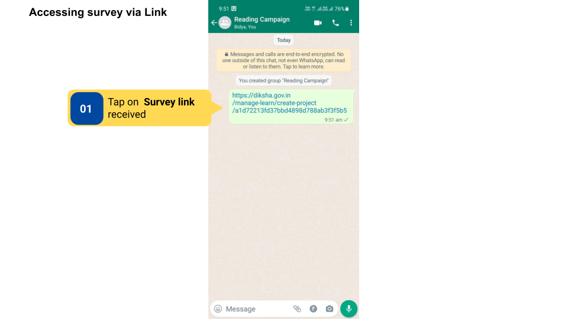
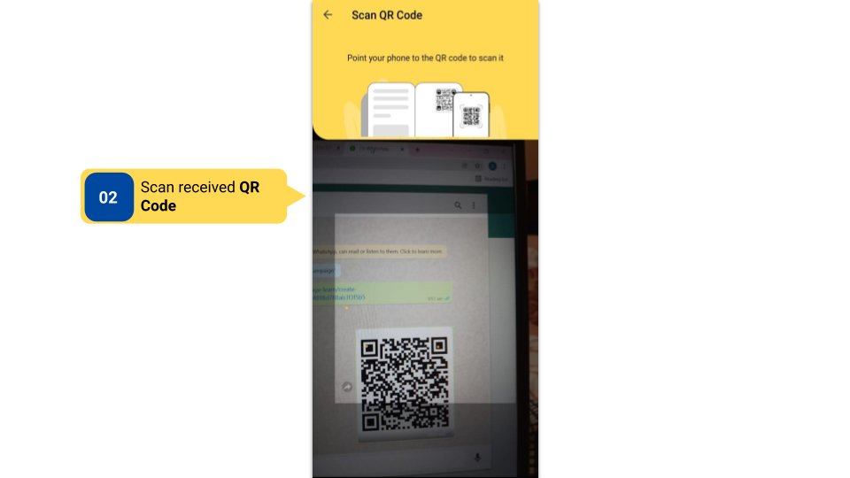

### Overview

Surveys are created by **Content Creator** and are visible only to targeted and signed-in users who are logged in as **HT & officials**.

**HT and other officials** can access surveys using the Program tile, Survey tile, survey link, or QR code.

### Before You Begin

<table>
  <tr><td>Who can access surveys?</td>
  <td>Users with HT and Officials role</td>
  </tr>
  <tr><td>What ways can a survey be accessed?</td>
  <td>Using the Programs tile, Survey tile, survey link, or QR code</td>
  </tr>
  <tr><td>What is required for HT and Officials to access surveys?</td>
  <td><ul><li>Updated profile with the board, sub role, and location (state, district, and other details).</li>
  <li>User should be on the Home Page.</li></ul></td>
  </tr>
</table>

### Outcome

<table>
 <tr><td>What will be the outcome?</td>
 <td>Access a survey with a set of questions.</td>
 </tr>
</table>

### Access Surveys on DIKSHA App

To access Surveys on DIKSHA App  

<table>
<tr>
  <th>Image with instructions</th>
</tr>
  <tr>
    <td></td>
  </tr>
  <tr>
    <td></td>
  </tr>
  <tr>
    <td></td>
  </tr>
  <tr>
    <td></td>
  </tr>
  <tr>
    <td></td>
  </tr>
  <tr>
    <td></td>
  </tr>
  <tr>
    <td></td>
  </tr>
  <tr>
    <td></td>
  </tr>
  <tr>
    <td></td>
  </tr>
  <tr>
    <td></td>
  </tr>
  <tr>
    <td></td>
  </tr>
  <tr>
    <td></td>
  </tr>
</table>

### Additional Notes

- A user can submit a survey only once.

- Survey will not be consumable to users after the expiry date.

- Users cannot view the survey in the list, 15 days after the expiry date.

### What’s Next?

- [Start Survey](../survey-consumption/start-survey.html){:target="_blank"}

- [Features in a Survey](../survey-consumption/features-in-survey.html){:target="_blank"}

