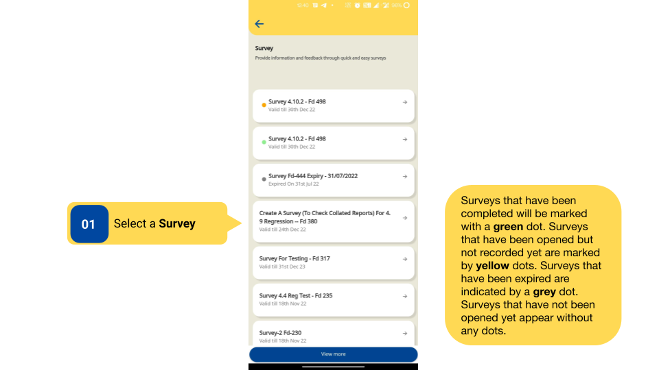
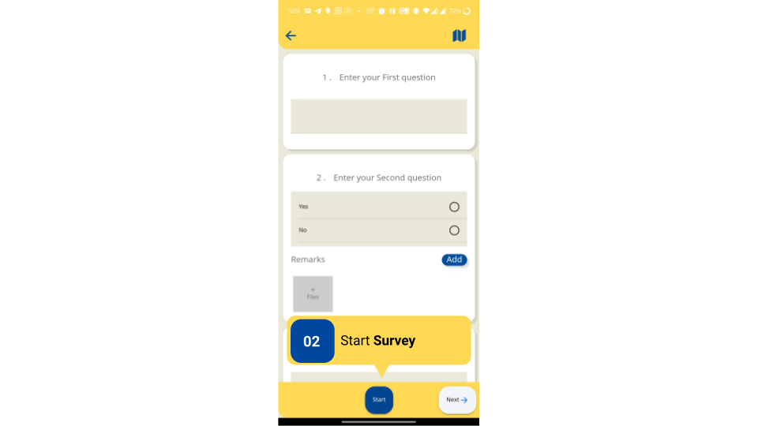
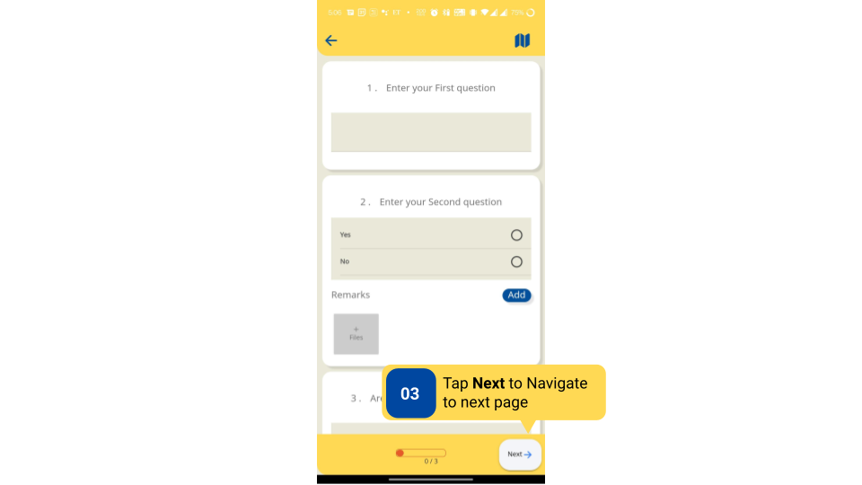

### Overview

- Surveys are designed to capture data for a set of targeted users.

- Surveys have multiple types of questions that allow the collection of different types of data. 

- Users can identify different Surveys through specific markings given as follows:

    - Surveys that have been completed will be marked with a green dot. 
    - Surveys that have been opened but not recorded yet are marked by yellow dots. 
    - Surveys that have expired are indicated by a grey dot.
    - Surveys that have not been opened yet appear without any dots. 

### Before You Begin

<table>
  <tr><td>Who can access Surveys?</td>
  <td>HTs and Officials</td>
  </tr>
  <tr><td>What is needed?</td>
  <td>Log in as an <b>HT and Officials</b>.</td>
  </tr>
</table>

### Outcome

<table>
 <tr><td>What will be the outcome?</td>
 <td>The Survey is started.</td>
 </tr>
</table>

### Start Survey

Start a survey

<table>
<tr>
  <th>Image with instructions</th>
</tr>
  <tr>
    <td></td>
  </tr>
  <tr>
    <td></td>
  </tr>
  <tr>
    <td></td>
  </tr>
</table>

### Additional Notes

- After a response is recorded, the question turns green.

- After the Survey is submitted, no edits can be made to it.

### What’s Next?

[Features in a Survey](../survey-consumption/features-in-survey.html){:target="_blank"}
