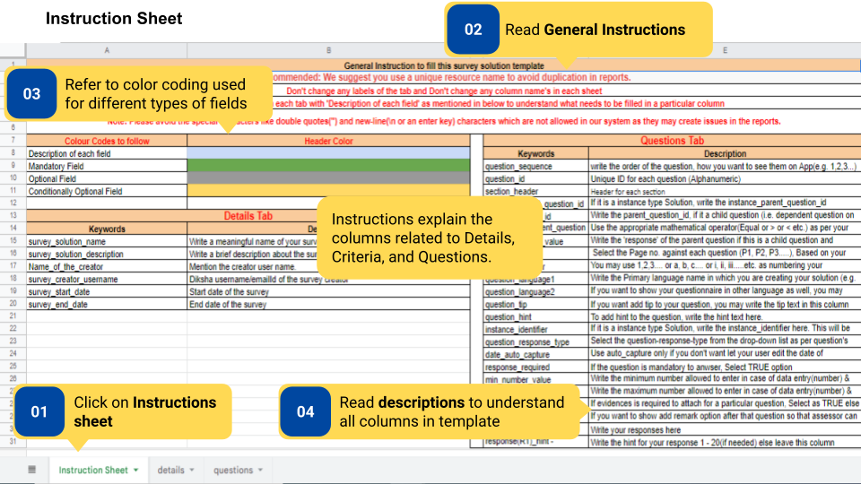
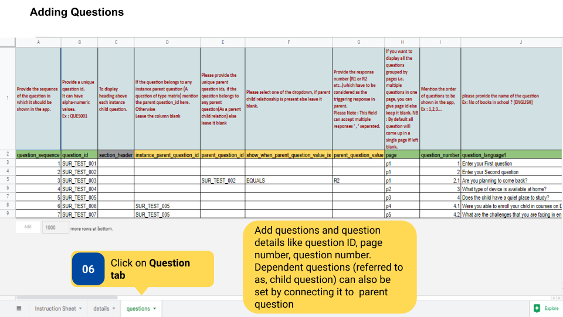
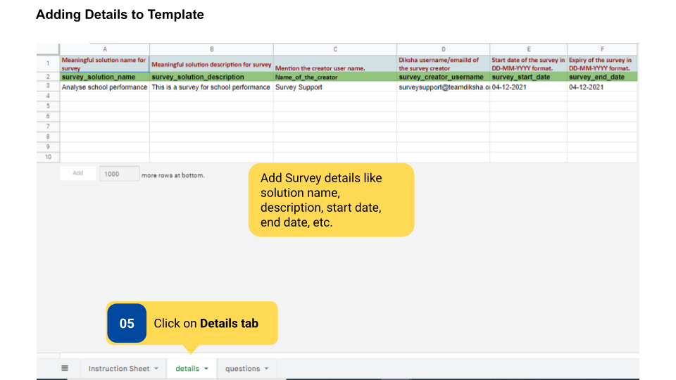

### Overview

Surveys are created and updated by the content creator through a template. After the filled template is sent over mail to the <a href = "mailto:surveysupport@teamdiksha.org" target="_blank">DIKSHA Support Team</a>, the support team uploads the survey on DIKSHA.

DIKSHA Surveys are created by Content Creator and can be viewed only by targeted users who are logged in as HT & officials. 

### Before You Begin

<table>
  <tr><td>Who can access surveys?</td>
  <td>HTs and Officials</td>
  </tr>
  <tr><td>What is needed?</td>
  <td>An editable copy of the Template <a href="https://docs.google.com/spreadsheets/d/1JiLbDCcUC1swpTKoKPBK5JGYh0rH332zBrPANZ7-eiI/edit?usp=sharing" target="_blank">Creating a Survey</a></td>
  </tr>
</table>

### Outcome

<table>
 <tr><td>What will be the outcome?</td>
  <td>The content creator completes and sends the template for the creation of the survey.</td>
  </tr>
</table>

### Create a Survey

To create a survey

<table>
<tr>
  <th>Image with instructions</th>
</tr>
  <tr>
    <td></td>
  </tr>
  <tr>
    <td></td>
  </tr>
  <tr>
    <td></td>
  </tr>
</table>

### Additional Notes

- Download the template to fill it.

- Survey template should be added to the program template by Program Designer to make it available on the platform.

