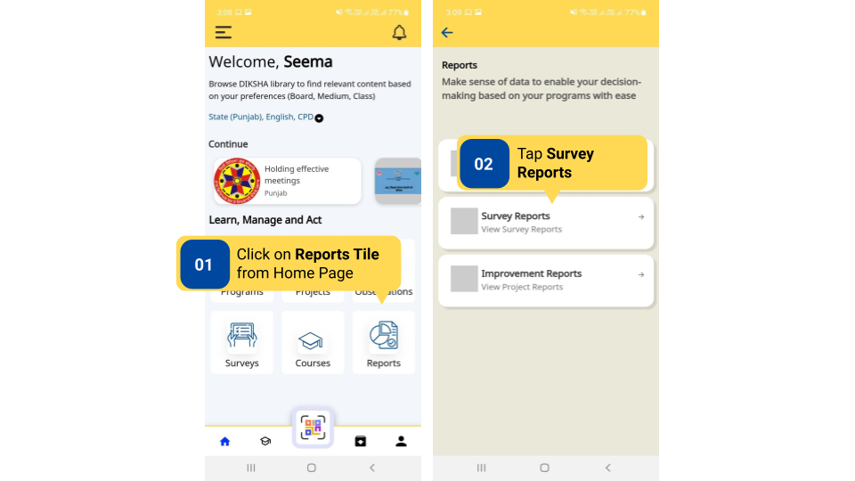
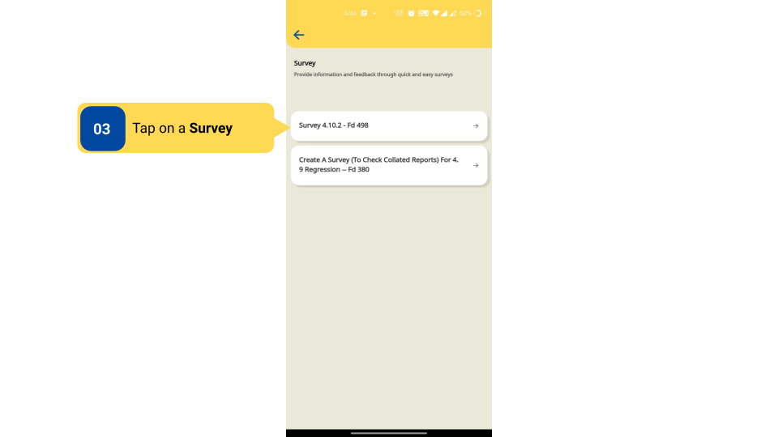
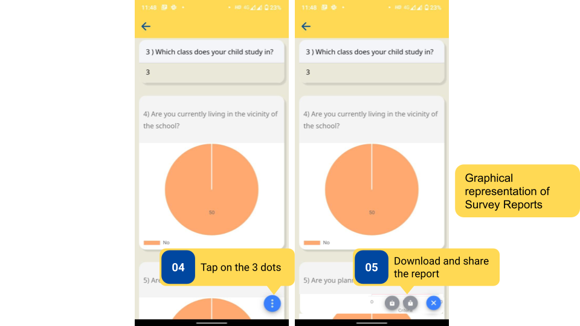

### Overview

On the DIKSHA app, reports are generated for the survey after submission. Reports provide an overview of the responses entered. Reports can also be shared and downloaded as a PDF file.

### Before You Begin

<table>
  <tr><td>Who can access survey reports?</td>
  <td>HTs and Officials, user and creator of the survey</td>
  </tr>
  <tr><td>How can HT and Officials access Survey Reports?</td>
  <td>Using the <b>Reports</b> tile on the Home page of the app</td>
  </tr>
</table>

### Outcome

<table>
 <tr><td>What will be the outcome?</td>
  <td><ul><li>The creator can view Survey Report and get graphical insights about the responses to the questionnaire.</li>
  <li>The user can view the questions and the responses that they have entered.</li>
  <li>Share Survey Report as a PDF.</li></ul></td>
  </tr>
</table>

### Survey Reports on DIKSHA App

To access Survey Reports on DIKSHA App:

<table>
<tr>
  <th>Image with instructions</th>
</tr>
  <tr>
    <td></td>
  </tr>
  <tr>
    <td></td>
  </tr>
  <tr>
    <td></td>
  </tr>
</table>

